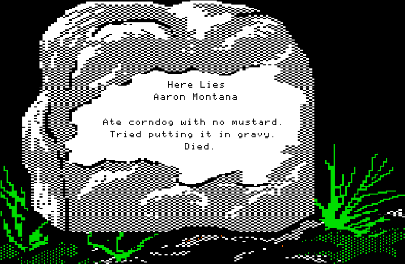

# OTTGaaS

Oregon Trail Tombstone Generator as a Service (because why not)



# Installation and Running

```
git clone https://github.com/jroyal/OTTGaaS.git

pip install -r requirements.txt

python server.py
```

# Api

| Endpoint | Description |
| ---- | --------------- |
| [GET /tombstone/:tombstone_name](#get-tombstonetombstone_name) | Display a tombstone |
| [POST /generate_tombstone](#post-generate_tombstone) | Create a new tombstone and return it |
| [POST /slack_generate_tombstone](#post-slack_generate_tombstone) | Special route to handle a slack slash command to create and return a tombstone |

### `GET /tombstone/:tombstone_name`

Retrieves the png tombstone file. If done in the browser it will actually display it.

##### Example Request

```
curl localhost:5000/tombstone/oddball_aaron > test.png

open test.png
```

### `POST /generate_tombstone/`

Creates and returns a new tombstone

##### Example Request

```
curl -X POST http://localhost:5000/generate_tombstone -H "Content-Type: application/json" -d '{"name": "James Royal", "inscription": "Something cliche"}' > test.png

open test.png
```

### `POST /slack_generate_tombstone/`

A special api endpoint that will handle slack slash command requests. The keywords are `name` and `inscription`

##### Example Slack Slash command

```
/ottgaas name James Royal inscription Something super cliche
```
